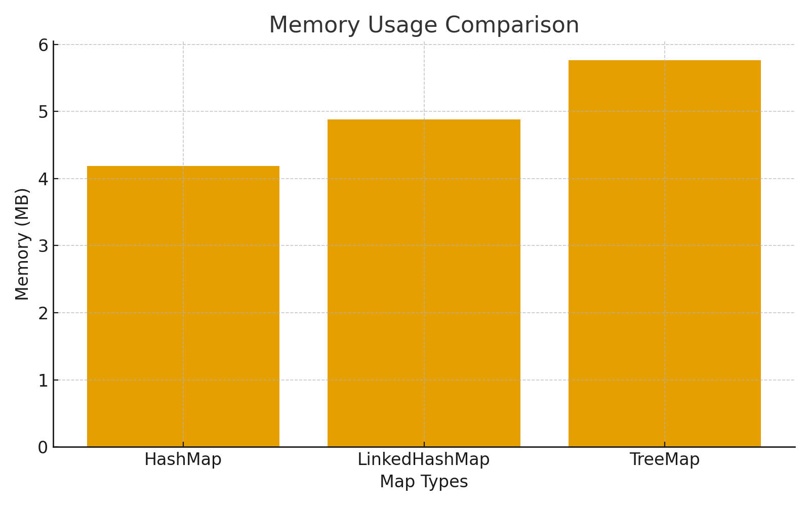
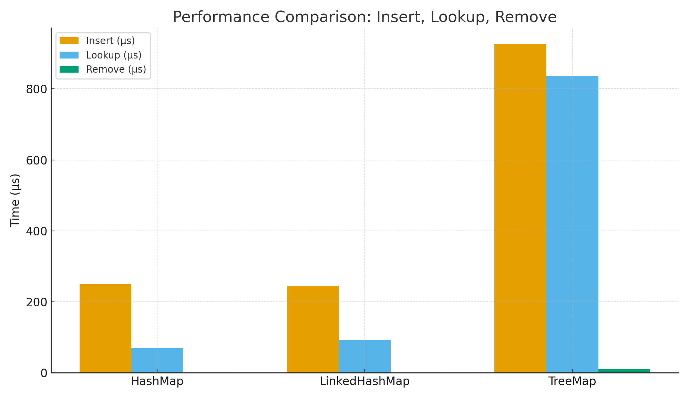

## Interface Map with implementation classes HashMap, LinkedHashMap and TreeMap.

### _Problem Statement_

In modern software development, choosing the correct data structure has a large 
impact on the performance, scalability, and maintainability of applications. 
Although Java provides several implementations of the Map interface, many developers 
choose a Map type based on habit rather than from a correct understanding of how 
the structure works internally. As applications expand, this may eventually lead to further issues.

This research compares **HashMap**, **LinkedHashMap**, and **TreeMap** to determine which 
implementation provides the best balance between **performance**, **readability**, and **maintainability** 
when handling large datasets.

### Central Research Question:

Which Map implementation in Java provides the best balance between performance, readability, 
and maintainability when handling large datasets?

## _What is the purpose of the Java Map interface, and what are its main implementations used for in software development?_

Maps are widely used to manage large collections of key–value relationships. Some examples are 
users and their sessions, products and their IDs, or candidates and their vote counts. 
Because this plays such a central role in data management, it is essential to understand 
how these different types behave under different workload conditions. The Java interface `Map` 
provides a flexible mechanism for storing and retrieving **unique key–value pairs**, allowing direct 
access to data through a key. Because of this, it is ideal for simulating real-world implementations 
like user profiles, configuration settings, or product descriptions with their identifiers (Oracle, 2015).

There are several Map implementations in Java such as **HashMap, LinkedHashMap, TreeMap, Hashtable, 
ConcurrentHashMap, WeakHashMap, and EnumMap.** Each implementation is designed to address specific 
requirements such as concurrency control, memory sensitivity, or ordering guarantees, but HashMap, 
LinkedHashMap, and TreeMap remain the most commonly used due to their general-purpose design and strong 
performance characteristics (Oaks, 2014).

- HashMap is the default choice for fast lookups, insertions, and removals, offering average 
constant-time operations through hashing (Oracle, 2015b).

- LinkedHashMap extends HashMap by storing entries in a predictable iteration order using a 
doubly linked list, making it useful for APIs, caching, and event tracking (GeeksforGeeks, 2023).

- TreeMap maintains keys in sorted order using a self-balancing Red-Black Tree, 
enabling features such as alphabetical ordering, sorted leaderboards, and efficient range queries (Baeldung, 2023).

Because these three implementations all share the same interface, developers can 
easily switch between them without changing their application logic or code structure, 
improving maintainability and flexibility.

## _How do HashMap, LinkedHashMap, and TreeMap differ in terms of insertion time, lookup time, and memory efficiency?_

To evaluate performance differences, a benchmark was executed using a custom Java test application.
This experiment included:

- Inserting 10,000 entries into each Map
- Performing 10,000 lookups
- Executing 100 remove operations
- Repeating the full process 1,000 times
- Using a fixed random seed
- Forcing garbage collection before each run to eliminate memory noise

_Benchmark Results:_

Type | 	Insert | Lookup | Remove | Memory Usage 
| -- | -- | -- | -- | -- |  
**HashMap**	| 249 µs | 69 µs | 1 µs | 4.189 MB
**LinkedHashMap** | 244 µs | 92 µs | 1 µs | 4.881 MB
**TreeMap** | 926 µs | 837 µs | 10 µs | 5.764 MB

### Interpretation of Results

_HashMap_

This performed the fastest overall on both insert and lookup operations, while also consuming 
the least memory. This aligns with its design: a simple hash table that stores entries in buckets, 
requiring minimal overhead (OpenJDK, 2025).

_LinkedHashMap:_ 

Interestingly, this one occasionally outperformed HashMap, even though it stores extra ordering pointers.
The reason for this behaviour is because:

- Both implementations share the same hashing and bucket system
- Performance also depends heavily on hash distribution
- Small differences in collisions can shift results

When collisions are distributed evenly, **LinkedHashMap** avoids some unfavorable bucket configurations 
that HashMap may encounter, resulting in faster measurements in certain runs. This illustrates an important 
theoretical insight: Maps with identical Big-O complexity can still differ due to micro-level factors such as:

- Bucket collision patterns
- CPU caching
- Branch prediction
- JIT compiler optimizations (Oaks, 2014).

Memory usage behaved exactly as expected: LinkedHashMap consumed more memory due to its doubly linked list.

_Treemap:_ 

These results were consistently the slowest in all operations. This is fully consistent with its internal structure: 
a self-balancing Red-Black Tree, where every insert, search, or delete involves:
- Multiple key comparisons,
- Tree traversal over multiple levels, 
- Occasional rotations or recoloring to maintain balance (Baeldung, 2023).

These steps guarantee predictable O(log n) behaviour but introduce more work than hash-based Maps. TreeMap 
also stores more references per entry, making it slightly less memory-efficient.

## _How do the internal structures of HashMap, LinkedHashMap, and TreeMap explain their performance differences_

The structural and algorithmic differences between HashMap, LinkedHashMap, 
and TreeMap clearly explain the performance patterns observed in the benchmark. 
Each implementation uses a fundamentally different strategy to store, navigate, 
and organize data, which directly influences its speed, memory usage, and practical use cases.

### HashMap: Fast lookups through hashing

HashMap is implemented using a hash table. Each key is converted into a hash value, 
which is then mapped to a specific bucket _(Oracle Documentation, n.d.)_. 
This allows the program to locate entries very quickly because it usually only needs 
to inspect a single bucket rather than search through the entire Map. 

The benchmark results reflect this design: after calculating the hash code, 
HashMap simply inserts the entry into the correct bucket or checks a short chain of elements 
within that bucket. Therefore its outcome of low memory usage makes total sense.

HashMap stores only what is required to manage hashing and collisions, without maintaining any ordering structure.

In practice, HashMap is ideal when performance is more important and if ordering is irrelevant. 

Common use cases include caching large datasets, counting occurrences, storing configuration values, 
and mapping IDs to objects in high-volume systems.

### LinkedHashMap: Predictable order with minimal overhead

LinkedHashMap is built on the same hash table structure as HashMap but adds a doubly linked 
list that preserves a stable iteration order _(GeeksforGeeks, 2023)_.
This additional list does not speed up operations, but it ensures predictable behaviour when iterating over keys.

Surprisingly, the benchmark shows that **LinkedHashMap** sometimes outperforms **HashMap**. 
This does not directly mean that linked lists are faster. 
Instead this reveals how strongly performance depends on hash distribution inside the buckets. 
When collisions are evenly spread, the cost of maintaining linked nodes becomes negligible, 
so LinkedHashMap performs similarly or slightly better due to cache-friendly access patterns.

- This highlights that micro-level factors such as bucket distribution and CPU caching can outweigh small theoretical overheads.

**LinkedHashMap** is therefore useful when predictable iteration order matters for example when generating JSON responses, 
implementing caches, preserving the order of user actions, or building APIs where stable output order improves
readability or testability.

### TreeMap: Logarithmic predictability through a Red-Black Tree

TreeMap differs fundamentally because it is implemented as a self-balancing Red-Black Tree _(Baeldung, 2024)_. 
Whenever the tree risks becoming unbalanced, it performs small corrective operations such as rotations or recoloring. 
By keeping the height close to `log₂(n)`, TreeMap guarantees that lookups, insertions, and deletions remain predictably 
efficient, even as the Map grows.

This stability comes at a cost:

- TreeMap must repeatedly compare keys
- Every action goes through multiple tree levels
- Occasional rebalances of the tree

As a result, TreeMap is slower than both HashMap and LinkedHashMap. It also uses more memory because 
each node stores pointers to its parent, left child, right child, and a color marker.
However, TreeMap provides capabilities that hash-based Maps cannot. Because keys are always sorted, 
it supports operations such as retrieving the smallest or largest key, and performing range queries 
via `subMap`, `headMap`, or `tailMap`. This makes TreeMap valuable in domains where order is essential, 
such as leaderboards, scheduling systems, and sorted indexing.

Overall, the results show that **HashMap** and **LinkedHashMap** offer the best performance, while **TreeMap** remains ideal when sorted 
keys are necessary. This benchmark also demonstrates an important theoretical point: although asymptotic complexity predicts 
general behavior, real performance can still vary depending on factors such as key distribution, JVM optimizations, 
and how well data fits into the CPU cache.

## How does understanding each Map type help developers make better design decisions and write more maintainable Java code?

Understanding the strengths and limitations of HashMap, LinkedHashMap, and TreeMap helps developers make design choices 
that produce cleaner, more predictable, and maintainable code. When the developer is aware of how each Map organizes its data, 
it becomes a lot easier to select a structure that naturally fits the problem: a HashMap for fast access, a LinkedHashMap for 
predictable order and a TreeMap for sorted navigation. 

These structures also prevent accidental usages in non-fitting situations such as choosing a TreeMap in a component where 
ordering is irrelevant or relying on repetitive order in a HashMap, which can lead to bugs or inconsistent behavior across runs.

Clear structural intent also improves readability. For instance, selecting LinkedHashMap for UI menus or JSON responses 
shows other developers that order is important. Similarly, using TreeMap in a ranking or scheduling module clearly indicates 
that sorted keys are necessary for that specific program to run.

From a maintainability perspective, choosing the right Map implementation leads to codebases that behave 
more predictably and are easier for teams to understand. When developers truly understand the internal 
mechanics of HashMap and TreeMap, they avoid unnecessary complexity such as using a TreeMap when ordering is 
irrelevant or manually sorting lists that a TreeMap could handle automatically. 

This shared knowledge also reinforces consistent team conventions, like using the default HashMap unless 
sorted order is explicitly required. As a result, clarity increases, performance pitfalls are avoided, and 
architectural decisions become more intentional. In the long run, aligning data structure choices with the
actual goals of the system reduces bugs, improves readability, and makes the code easier
to extend or modify as requirements evolve.

## Conclusion

This research was set out to answer the central question: Which Map implementation in Java provides 
the best balance between performance, readability, and maintainability when handling key–value data? 

The results show that there is no single “best” Map for every situation, but rather a best choice depending 
on the requirements. The benchmark demonstrated that HashMap delivers the fastest insertion and lookup times 
with the lowest memory usage, making it the most efficient option for performance-critical tasks. 

They also show that practical performance is influenced by more than Big-O complexity alone; factors 
such as collision patterns, JVM optimizations, and memory layout can all affect real-world behavior. 
Understanding these structural and performance characteristics helps developers make informed design choices. 

Selecting HashMap for fast access, LinkedHashMap for predictable ordering, 
or TreeMap for sorted data will lead to clearer, more maintainable, and more predictable code.

Therefore, the answer to the main question is that `HashMap` generally offers the best balance for most use cases, 
but LinkedHashMap and TreeMap become the superior choice when ordering or sorted behavior is required. 
The “best” Map is ultimately the one whose internal behavior matches the functional goals of the application.

## Resources (APA-7)

-	Baeldung. (2023). A guide to TreeMap in Java. https://www.baeldung.com/java-treemap
-	GeeksforGeeks. (2023). Map interface in Java. https://www.geeksforgeeks.org/java/map-interface-in-java/
-	Oracle. (2015). Java Platform, Standard Edition 8 API Specification: java.util.Map. https://docs.oracle.com/javase/8/docs/api/java/util/Map.html
-	Oracle. (2015). Collections framework overview. https://docs.oracle.com/javase/8/docs/technotes/guides/collections/overview.html
-	Oaks, S. (2014). Java Performance: The Definitive Guide. O’Reilly Media.
-	OpenJDK. (2025). HashMap implementation source code.. https://hg.openjdk.org/jdk/jdk/file/tip/src/java.base/share/classes/java/util/HashMap.java

