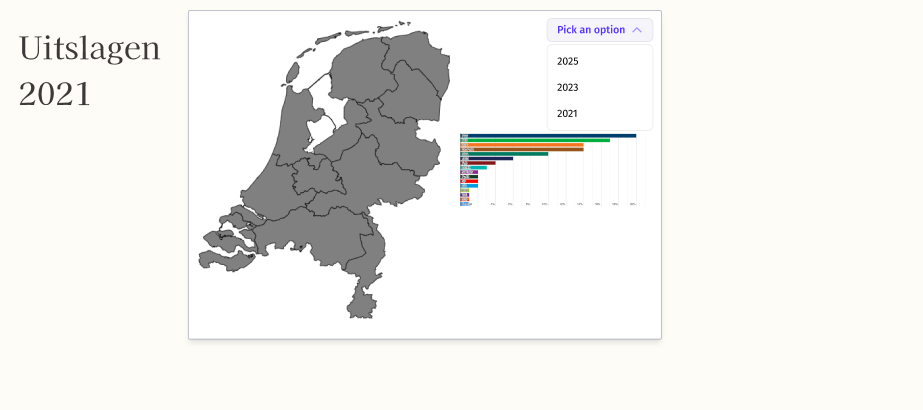

# A/B test - sprint 4
## 14-11-2025

> *Voor sprint 4 hebben we onderzocht welke grafiek het meest geschikt is voor onze visualisatie. We hebben daarbij twee opties getest: een piechart en een staafdiagram. Tijdens het testen hebben we gekeken naar overzichtelijkheid, leesbaarheid en hoeveel informatie de grafiek in één oogopslag kan laten zien. Op basis van deze testen gaan we uiteindelijk bepalen welke van de twee het beste past bij ons project.*

### De ontwerp van de map

| Versie A | Versie B
| -- | -- |
|  |  |

#### Testpersonen en hun reacties:

> **Manal**:
> *"Ik kies voor versie B, omdat je in deze weergave alle partijen duidelijk kunt zien. Bij de piechart raak je snel het overzicht kwijt, omdat niet alle partijen zichtbaar zijn of goed uit elkaar te halen zijn."*

> **Mauro**:
> *"Ik vind versie B beter, omdat de partijen veel duidelijker worden weergegeven. Je kunt meteen zien welke partijen erbij horen en hoe ze zich tot elkaar verhouden, terwijl dat bij een piechart minder overzichtelijk is."*

---

## Algemene conclusie

