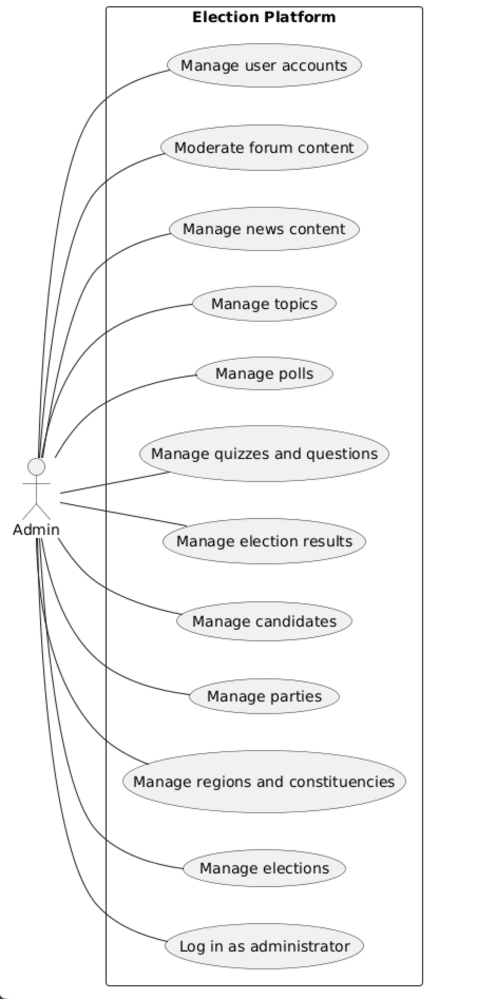
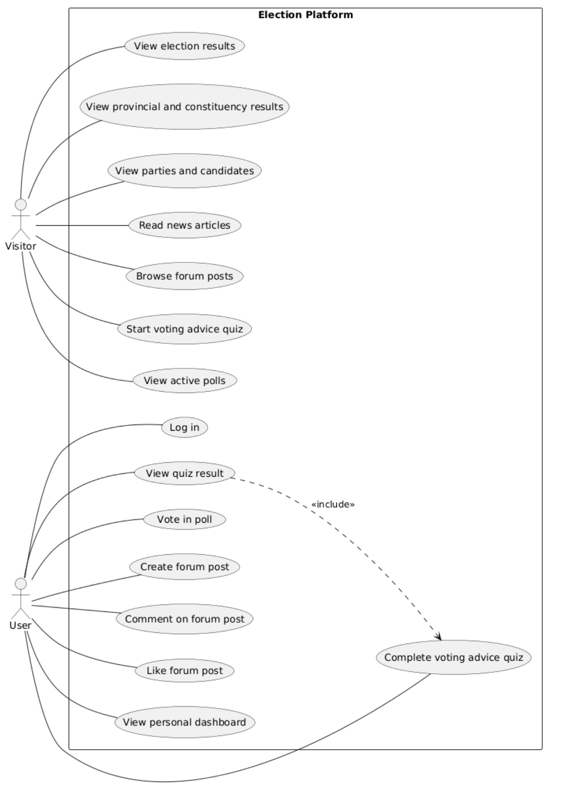

# Use Case Diagram 

### Visitor & User Use-Case Diagram

This use-case diagram describes the primary interactions for visitors 
and registered users of the Election Platform. Visitors can access public election 
data, explore parties and candidates, view regional results, and read news items. 
Authenticated users gain additional interactive functionality, such as participating in quizzes, 
viewing personalized results, and engaging in forum discussions.

### Admin Use-Case Diagram 

This use-case diagram represents the administrative responsibilities within the Election Platform. 
Administrators manage election-related data, political entities, content, and user accounts. 
The diagram highlights the separation between public user functionality and backend management tasks.

