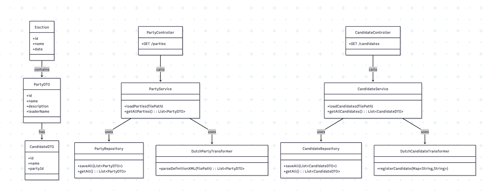
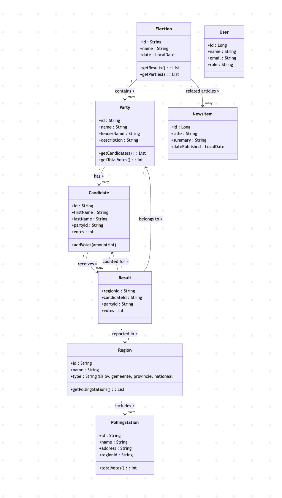

# UML 

Eerste versie van onze UML: 

Tweede versie na ontvangen feedback: 

In mermaid: 

    class Election {
    +id : String
    +name : String
    +date : LocalDate
    +getResults() : List<Result>
    +getParties() : List<Party>
    }

    class Party {
        +id : String
        +name : String
        +leaderName : String
        +description : String
        +getCandidates() : List<Candidate>
        +getTotalVotes() : int
    }

    class Candidate {
        +id : String
        +firstName : String
        +lastName : String
        +partyId : String
        +votes : int
        +addVotes(amount:int)
    }

    class Result {
        +regionId : String
        +candidateId : String
        +partyId : String
        +votes : int
    }

    class Region {
        +id : String
        +name : String
        +type : String  %% bv. gemeente, provincie, nationaal
        +getPollingStations() : List<PollingStation>
    }

    class PollingStation {
        +id : String
        +name : String
        +address : String
        +regionId : String
        +totalVotes() : int
    }

    class User {
        +id : Long
        +name : String
        +email : String
        +role : String
    }

    class NewsItem {
        +id : Long
        +title : String
        +summary : String
        +datePublished : LocalDate
    }

    Election "1" --> "many" Party : contains >
    Party "1" --> "many" Candidate : has >
    Candidate "1" --> "many" Result : receives >
    Region "1" --> "many" PollingStation : includes >
    Result "*" --> "1" Region : reported in >
    Result "*" --> "1" Party : belongs to >
    Result "*" --> "1" Candidate : counted for >

    Election "1" --> "many" NewsItem : related articles >
