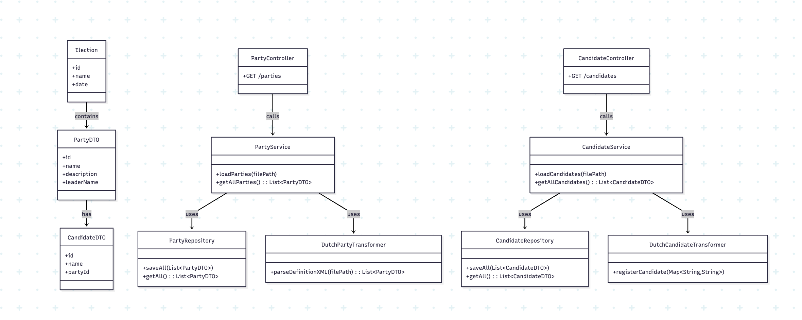

# UML

Een overzicht van de klassen die we in ons project gaan gebruiken. Hieronder staat deze UML in mermaid beschreven.

    class Election {
        +id
        +name
        +date
    }

    class PartyDTO {
        +id
        +name
        +description
        +leaderName
    }

    class CandidateDTO {
        +id
        +name
        +partyId
    }

    class PartyRepository {
        +saveAll(List~PartyDTO~)
        +getAll(): List~PartyDTO~
    }

    class CandidateRepository {
        +saveAll(List~CandidateDTO~)
        +getAll(): List~CandidateDTO~
    }

    class DutchPartyTransformer {
        +parseDefinitionXML(filePath): List~PartyDTO~
    }

    class DutchCandidateTransformer {
        +registerCandidate(Map~String,String~)
    }

    class PartyService {
        +loadParties(filePath)
        +getAllParties(): List~PartyDTO~
    }

    class CandidateService {
        +loadCandidates(filePath)
        +getAllCandidates(): List~CandidateDTO~
    }

    class PartyController {
        +GET /parties
    }

    class CandidateController {
        +GET /candidates
    }

    Election --> PartyDTO : contains
    PartyDTO --> CandidateDTO : has

    PartyService --> PartyRepository : uses
    CandidateService --> CandidateRepository : uses

    PartyService --> DutchPartyTransformer : uses
    CandidateService --> DutchCandidateTransformer : uses

    PartyController --> PartyService : calls
    CandidateController --> CandidateService : calls
