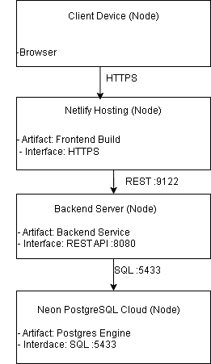

# -- Deployment 

## Front-end (Amin)

## Back-end (Ramzi)

First go to the backend folder in the terminal and run:

`docker build -t <dockerhub-username>/election-backend .`

This builds the Docker image for the backend.

After you have built the docker image you need to push the image to Docker Hub so OEGE can acces it:

`docker push <dockerhub-username>/election-backend`

When you're done with that proceed to login into OEGE on your pc terminal. 
After you've logged in pull the image from docker hub:

`docker pull <dockerhub-username>/election-backend`

Finally, start the backend container on OEGE: 

`docker run -d \
--restart=always \
--name election-backend \
-p 0.0.0.0:9122:8080 \
<dockerhub-username>/election-backend`

the backend will now be running at:
http://oege.ie.hva.nl:9122

(Port 9122 is just an example, any free port between 8000-10000 can be used)

## How did we deploy and why did we choose this method? (Morsal)

For the deployment of our backend we chose a Docker-based deployment 
using Docker Hub and a remote server (OEGE).
This method allowed us to create a consistent, reproducible and team-friendly 
deployment pipeline without depending on local machine configurations.

**Why Docker?**

Docker ensures that the backend runs in exactly the same environment 
everywhere: locally, on a teammate’s machine, and on the server.
By packaging the application together with its runtime, dependencies 
and configuration into a single image, we eliminated issues such as:

- “It works on my machine”
- Differences in Java versions or environment variables
- Manual server setup and configuration errors

This was especially important in a team setting, where multiple 
developers work on the same backend.

### Why Docker Hub + OEGE?

We used Docker Hub as a central image registry so the backend image could 
easily be shared and pulled by the server.
This decouples the build process from the deployment environment:

- The image is built once
- Pushed to Docker Hub
- Pulled and run on OEGE

OEGE was chosen because it provides a stable Linux-based server 
environment with Docker support, making it suitable for hosting containerized applications.
By exposing the backend through a configurable port, we could keep the setup 
flexible and avoid port conflicts with other services.

### Benefits of this approach

This deployment strategy provided several advantages:

**Consistency:** The same Docker image is used in all environments

**Simplicity:** No complex server provisioning was required

**Scalability:** Containers can easily be restarted or replaced

**Reliability:** Automatic restarts ensure the backend stays online

**Team collaboration:** Any team member can deploy the backend in the same way

Overall, this approach allowed us to focus on development and 
functionality, while keeping deployment clear, controlled and reproducible.

### Diagram: (Betul)

